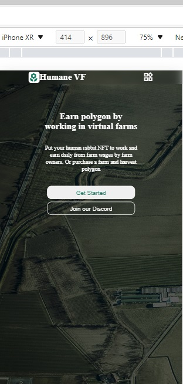

# Projeto Lovt

## Sobre o projeto
Página montada a partir do figma, utilizando noções básicas de flexbox, background-images,pseudoelementos e media para responsividade.

## Author:
-Eduardo G Sena (https://github.com/EduardoDev94)

## Tecnologias Utilizadas
**Front End**: 
-Html  -CSS

                